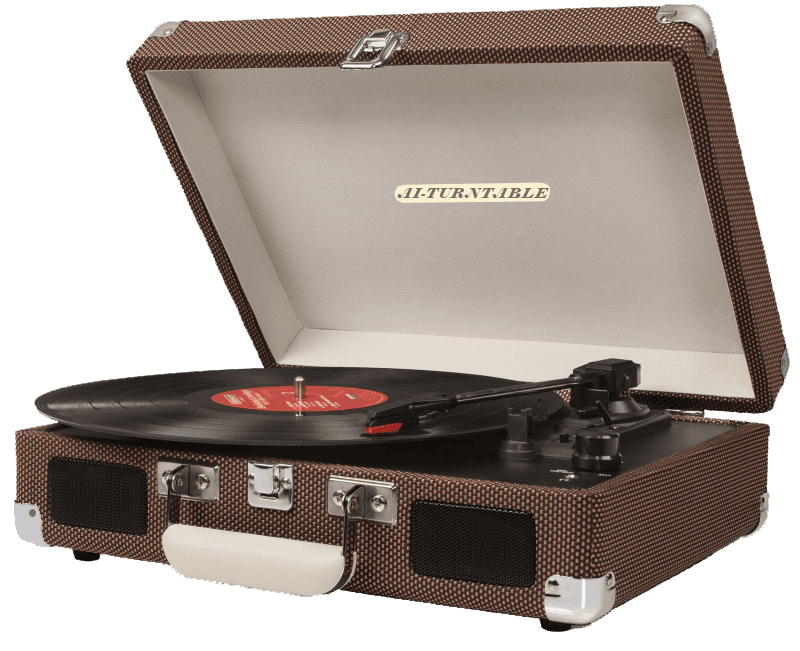

# Vinyl Player React App
[Live Demo](https://ai-turntable.netlify.app)

Welcome to the Vinyl Player React App! This application allows users to immerse themselves in the nostalgic experience of listening to music on a vintage turntable, all within the comfort of their web browser. Users can select their favorite tracks and watch as the vinyl spins and the music plays.

## Features

- Simulated turntable interface for an authentic experience.
- Selection of tracks to play.
- Live previews
- Smooth and responsive UI
- Fullscreen mode
- Cross platform

## Who is it for?

This project is perfect for music enthusiasts who appreciate the charm of vinyl records and want to relive the experience of listening to them. It's also great for developers looking to explore React.js and frontend web development.
## How to Use:

1. Clone the repository.
2. Run `npm install` to install dependencies.
3. Run `npm start` to start the development server.
4. Open the provided URL in your web browser to experience the vinyl player.
## Tech Stack

**Client:** React, Redux, Bootstrap.

**Server:** Node, Express, MongoDB.

